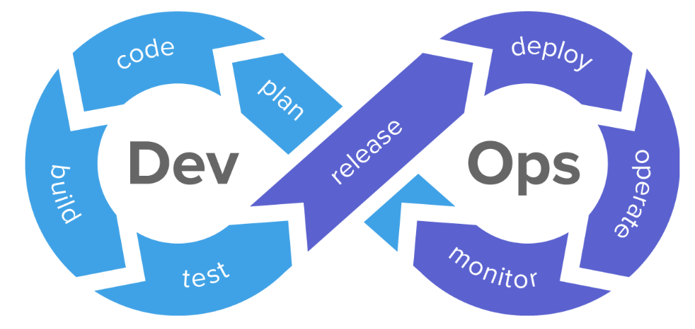

## 1. What is **DevOps**?

- The word `DevOps` literally is a combination of the terms *development* and *operations*. It represents a collaborative or shared approach to the tasks performed by a company's software/application development team and IT operations team.

- It is not a technology, but an approach, a philosophy or a methodology to improve work throughout the software development lifecycle by using various tools.

-   **Visualizing a DevOps process:**
    - It can be thought of as an infinite loop, as depicted by the picture below:

        

## 2. What is Automation, Scaling, Infrastructure?
- **Automation** : 
    - Automation is an essential component of DevOps.
    - It's aim is to automate manual and repitive tasks.
    - It involves automating at all levels of a software development lifecycle. 
    - Example : Testing if a code works correctly on different machines, compatible with certain software versions or dependencies, running a particular script *at specific time intervals on particular machines*, etc.

- **Scaling** : 
    - Implies development of systems that can handle increased load.
    - It enables the organization to deliver a product that can handle a large volume of users.
    - 3 types of scaling:
        - **Horizontal scaling** : To accomodate growing users, more instances of a machine or service are deployed.
        - **Vertical scaling** : To accomodate growing users or improve performace, existing instances are enhanced with increasing processing power, RAM, GPU power, etc.
        - **Load balancing** : A load balancer distributes the incoming traffic across multiple instances of an application/service. This ensures performance improvement, resource utilization and load handling.

- **Infrastructure**:

    - Infrastructure is the physical and virtual entity of an organization that is required to run its applications or services.
    - Servers, networks, databases, etc are classified as physical infrastructure while cloud-based servers and networks, cloud-computing platforms etc are examples of virtual infrastructure.

## 3. Why DevOps is Important, etc?

- To avoid Developers resort to the "It worked on my machine" response when a problem arises 🫣. Just kidding...
- To reduce wait times, manual testing and lengthy review processes, the project development can be sped up.
- It helps organizations to work more collaboratively, as all the involved teams understand exactly what standard they need to maintain for the product; right from start to deployment in production.
- Enable continuous improvement of the software/product/service.