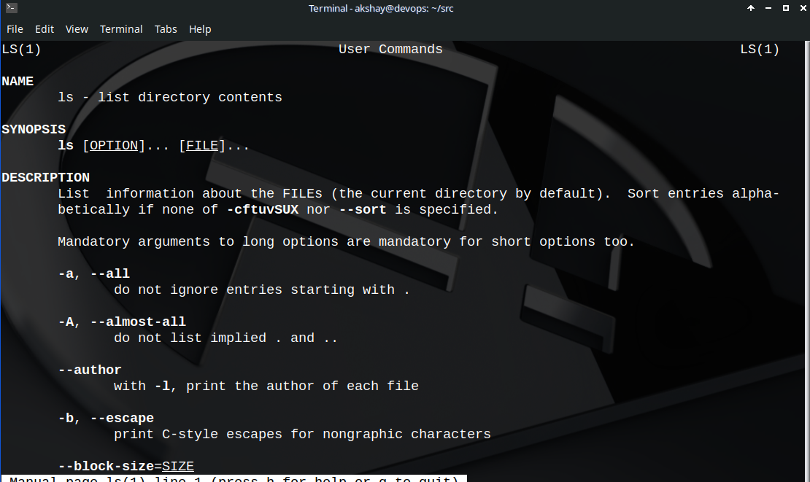
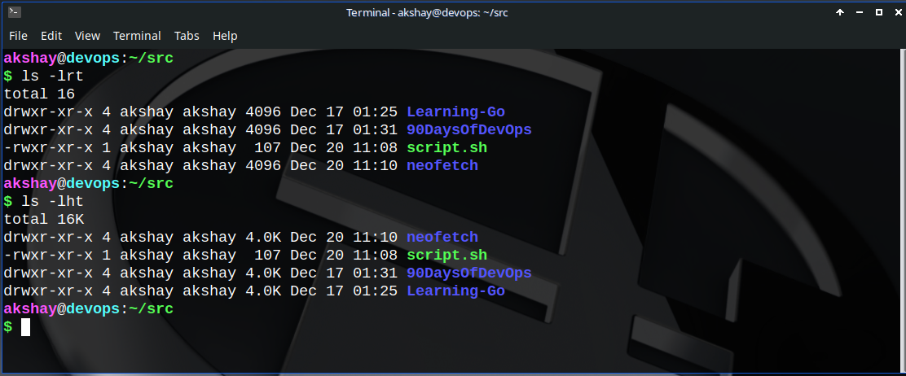

## Task: Write Linux commands to :

### 1\. Check your present working directory.

```bash
pwd
```

### 2\. List all the files or directories including hidden files.

```bash
ls -a
```

### 3\. Create a nested directory A/B/C/D/E

```bash
mkdir -p A/B/C/D/E
```

## NOTE!

<div data-node-type="callout">
<div data-node-type="callout-emoji">💡</div>
<div data-node-type="callout-text"><strong>I had highly recommend reading the man-page of any linux command or utility you come across.</strong></div>
</div>

[Man pages](https://man7.org/linux/man-pages/man1/man.1.html) are available on both your linux machine and the Internet.

For e.g., to read the man page of **ls** command, just type the following in your terminal:

```bash
man ls
```

A `man` page looks something like this below. Not necessarily by color, but yeah... :)



While it is convenient to have handy commands with flags like following:

```bash
ls -a    #prints all the files in a directory including the hidden ones
ls -l    #prints detailed information of directory contents
ls -al   #composite flags to a command
ls -al /home/$USER/Documents #composite flags to a particular path
```

### But what if you want to print the directory contents in a sorted fashion of their creation of date??

> Here I recommend you going to the man page first. It's a habit that might require efforts initially to get used to, but in the long run, it will make you independent. Often in certain certification exams, internet access is restricted; Only man pages are allowed.

The solution to above is `ls -t` actually!

Also, see the image below and try answering what those two commands actually do.



Besides this, the most frequently used commands in linux are:

1. `cp` -&gt; copy a file/folder
    
2. `mkdir` -&gt; create directory
    
3. `touch` -&gt; create a file
    
4. `rm` -&gt; remove a file/folder
    
5. `cd` -&gt; change directory
    
6. `clear` -&gt; erase terminal screen
    
7. `echo` -&gt; display a line of text
    
8. `exit` -&gt; terminate a process
    
9. `cat /` [`bat`](https://github.com/sharkdp/bat) (check this one out, it's cool) -&gt; display contents of a file
    
10. `sudo` -&gt; execute a command as superuser
    
11. `ping` -&gt; check if connected to internet
    

### Happy Learning ;)