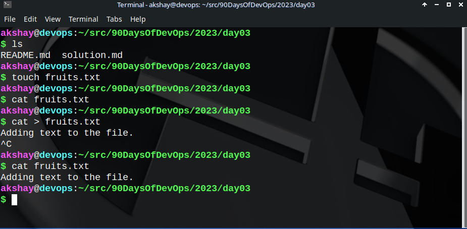

1. To view what's written in a file.

cat <filename>

This can also be achieved with less or more commands. Check out more in their man pages.

2. To change the access permissions of files.

chmod +x script.sh

The above command makes the script.sh file an executable.

sudo chmod 777 <filename>

The mode 777 Recursively give  read, write and execute permissions to all users of all groups under the root(/)

3. To check which commands you have run till now.

history

4. To remove a directory/ Folder.

rmdir <folder_name> # if the folder is empty
rm -rf <folder_name> # to recursively force-delete all the contents of the directory

5. To create a fruits.txt file and to view the content.

touch <file_name> # creates a file
cat <file_name> # view contents of the file

6. Add content in devops.txt (One in each line) - Apple, Mango, Banana, Cherry, Kiwi, Orange, Guava.

 # terminate with Ctrl+C
cat > [data] # overwrite the file with 'data'
cat >> [data to append] # appends data at the current EOF of the file.

7. To Show only top three fruits from the file.

head -n <file_name>

8. To Show only bottom three fruits from the file.

tail -n <file_name>

9.To create another file Colors.txt and to view the content.

touch Colors.txt; cat Colors.txt

10. Add content in Colors.txt (One in each line) - Red, Pink, White, Black, Blue, Orange, Purple, Grey.

11. To find the difference between fruits.txt and Colors.txt file.

diff <file1> <file2>

The result of diff above tells that the two files differ at all values that are printed with a ">" in the beginning. Thus, here in devops.txt file, the line just above Purple is same in both the files.

Happy Learning ;)
