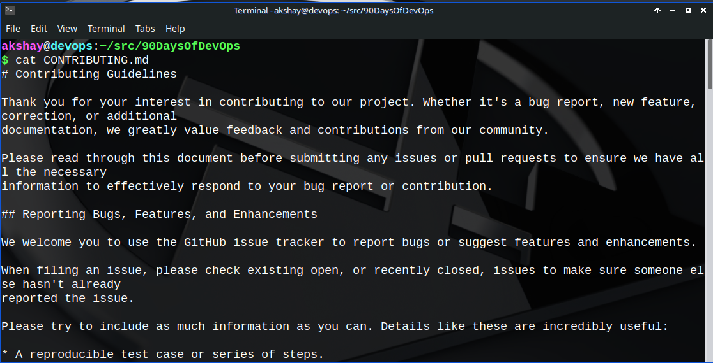
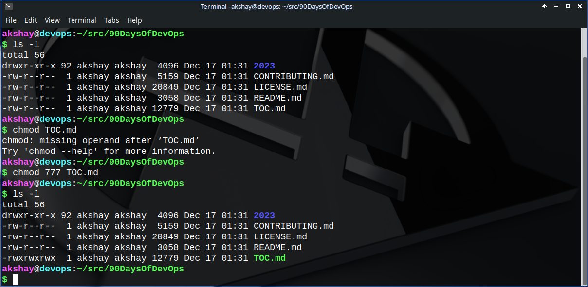
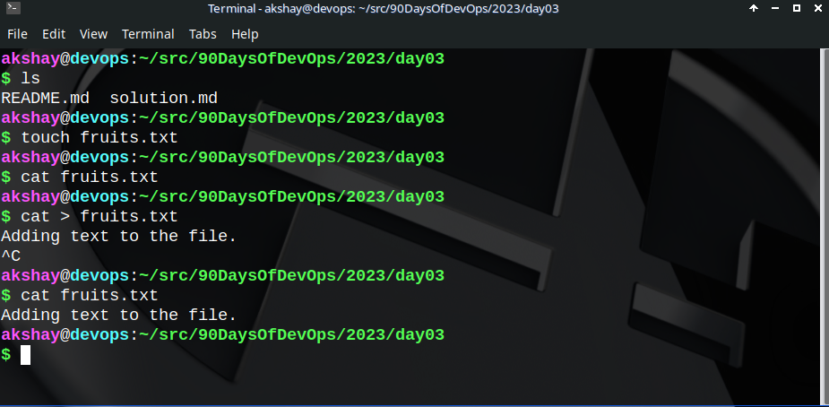
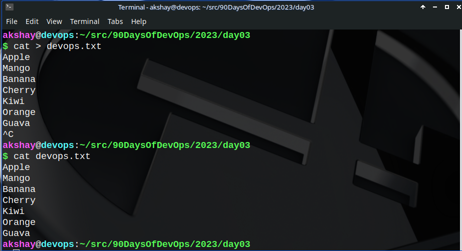
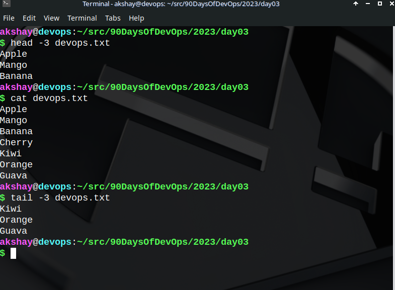
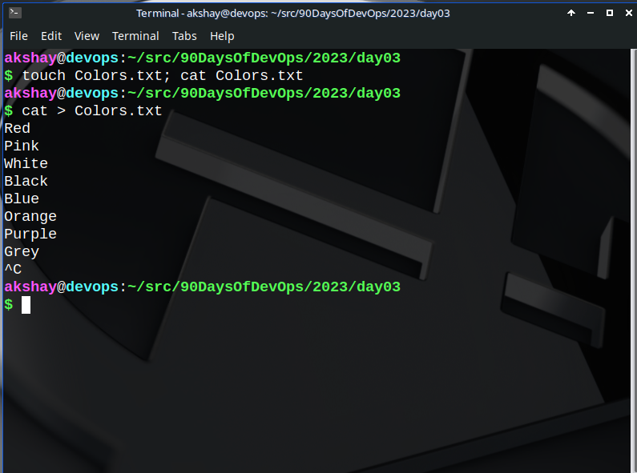
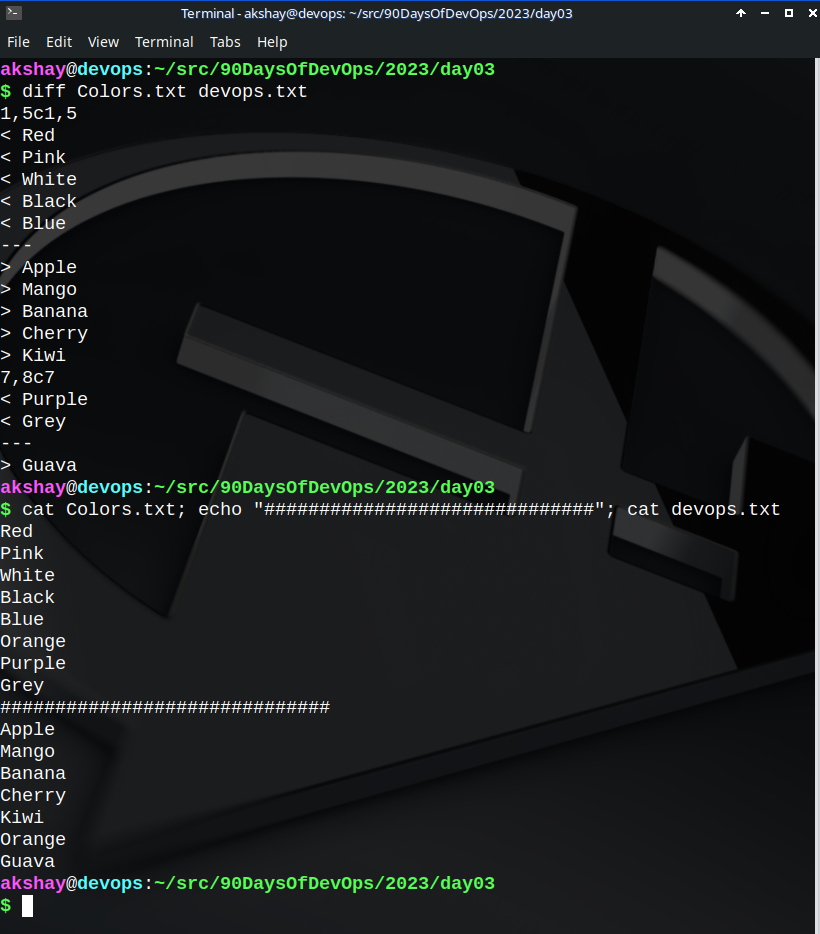

## 1\. To view what's written in a file.

```bash
cat <filename>
```



This can also be achieved with `less` or `more` commands. Check out more in their man pages.

*Alternatively, you can also try a "beautified cat" :* [***bat***](https://github.com/sharkdp/bat)

## 2\. To change the access permissions of files.

```bash
chmod +x script.sh
```

The above command makes the `script.sh` file an executable.

```bash
sudo chmod 777 <filename>
```

The mode `777` Recursively give read, write and execute permissions to all users of all groups under the root(/).



## 3\. To check which commands you have run till now.

```bash
history
```

## 4\. To remove a directory/ Folder.

```bash
rmdir <folder_name> # if the folder is empty
rm -rf <folder_name> # to recursively force-delete all the contents of the directory
```

## 5\. To create a fruits.txt file and to view the content.

```bash
touch <file_name> # creates a file
cat <file_name> # view contents of the file
```



## 6\. Add content in devops.txt (One in each line) - Apple, Mango, Banana, Cherry, Kiwi, Orange, Guava.

```bash
 # terminate with Ctrl+C
cat > [data] # overwrite the file with 'data'
cat >> [data to append] # appends data at the current EOF of the file.
```

What is **"cat &gt; file1"**?

> *It overwrites data into file1, i.e. the previous data in file1 gets replaced by the new one entered by the user.*

What is **"cat &gt;&gt; file1"**?

> It appends data into file1, i.e. concatenates data entered by the user from the present EOF of the file.



## 7\. To Show only top three fruits from the file.

```bash
head -n <file_name>
```

**head** -&gt; output the first parts of files.

## 8\. To Show only bottom three fruits from the file.

```bash
tail -n <file_name>
```

**tail** -&gt;output the last parts of files.



## 9.To create another file Colors.txt and to view the content.

```bash
touch Colors.txt; cat Colors.txt
```

**touch** \-&gt; If file doesn't exist, it creates the file. Else, it's actual use is to update the access and modification times of each FILE to the current time.

What the command in the answer does is synchronous execution, i.e. first touch Colors.txt is created if it doesn't already exist, else it updates it timestamp. Then it tries to print the contents of Colors.txt file to the terminal.

## 10\. Add content in Colors.txt (One in each line) - Red, Pink, White, Black, Blue, Orange, Purple, Grey.



## 11\. To find the difference between fruits.txt and Colors.txt file.

```bash
diff <file1> <file2>
```

The **diff** command compares files line by line. Often used to see if two files contain the same data or not. If they are the **exact same**, **nothing is printed** as output to the command.



The result of `diff` above tells that the two files differ at all values that are printed with a "**&gt;"** in the beginning. Thus, here in `devops.txt` file, the line just above `Purple` is same in both the files.

### Happy Learning ;)