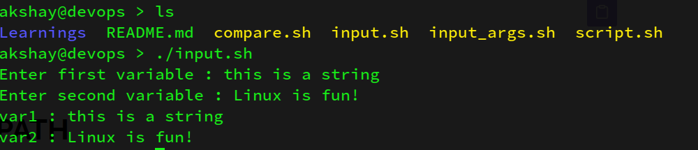
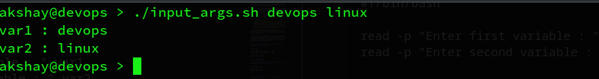
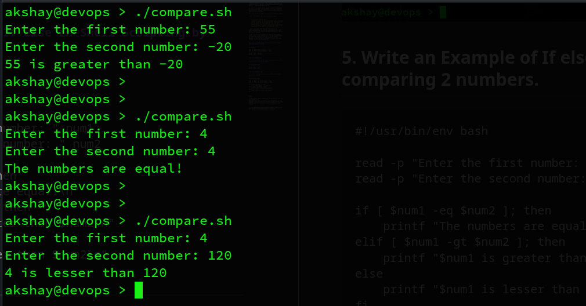

## *Background*

A shell is a user interface that allows users to interact with the system's services and utilities while also allowing execution of commands. It acts as an intermediary between the user and the operating system to facilitate communication between the two.

***Scripting in Linux*** in simple terms means the developement of scripts using shell programming languages on a UNIX-based operating system. E.g. bash script, zsh script, etc.

It is generally used to automate tasks(e.g. using **cron**), make/edit system **configurations**(installation files), write a program(e.g. [**neofetch**](https://github.com/dylanaraps/neofetch)) and perhaps for administration on a Linux system.

### **1\. Explain in your own words and examples, what is Shell Scripting for DevOps.**

> Shell Scripting for DevOps largely implies using shell programming to automate DevOps tasks and processes. It is to ensure proper sequencing of operations, smooth workflows and managing infrastructure.

It may be used in the following stages of DevOps along with others if need arises:

* **Periodic task performance** : Shell scripting can be used to automate a particular task to be triggered at a particular time periodically.
    
* **Cleaning up disk** : It may be desirable to clear cache memory or temporary files and partitions after they start consuming resources above a particular threshold.
    
* **System checkup and scans** : This largely comes under the monitoring part of DevOps. It involves scanning for health checkup, system vulnerabilities, pipeline breaks, etc.
    

In essence, it **speeds up** the software-development process by allowing engineers focus on more important tasks instead of performing time-consuming, boring and repetitive tasks manually. Another desirable advantage can be a better quality software through automation in shorter time.

### 2\. **What is** `#!/bin/bash?` **can we write** `#!/bin/sh` **as well?**

* The `#!/bin/bash` line is a **shebang** line.
    
* *a little bit of OS (Operating Systems) here...*
    
    > Whenever we try to run an executable file, the `execve` program is called and the new process replaces the old one to decide how that should be done. For this, execve expects the **first two characters** of the file to be `"#!" (read as shebang)` followed by a path to the interpreter to be used to interpret the script.
    
* We can write `/bin/bash` or `/bin/sh` depending on the shell used by the larger intended population. However, we prefer using **/bin/bash** as it is the standard shell in modern UNIX systems with some advanced features. However, if the goal is portability among older UNIX systems where bash may NOT be installed, **/bin/sh** may be preferred.
    

### 3\. **Write a Shell Script which prints I will complete** `#90DaysOfDevOps` **challenge**

```bash
#!/usr/bin/env bash

printf "I will complete #90DaysOofDevOps challenge\n"
```

***Simple Task (for you)*** *: What is the difference between* ***echo*** *and* ***printf*** *in bash?*

### 4\. **Write a Shell Script to take user input, input from arguments and print the variables.**

```bash
#!/bin/bash

read -p "Enter first variable : " var1
read -p "Enter second variable : " var2

printf "var1 : $var1\n"
printf "var2 : $var2\n"
```



The above script prompts to the user to enter variables. The input to those prompts are stored in variables var1 and var2 respectively. Finally they are printed onto the terminal.

```bash
#!/usr/bin/env bash

printf "var1 : $1\n"
printf "var2 : $2\n"
```



In bash scripting, there is no need to exclusively write any code to accept command line arguments as against C or Python languages. In bash, you can directly access the command line arguments as shown above using the **'$'** sign followed by the order number of that variable.

### **5\. Write an Example of If else in Shell Scripting by comparing 2 numbers.**

```bash
#!/usr/bin/env bash

read -p "Enter the first number: " num1
read -p "Enter the second number: " num2

if [ $num1 -eq $num2 ]; then
    printf "The numbers are equal!\n"
elif [ $num1 -gt $num2 ]; then
    printf "$num1 is greater than $num2\n"
else
    printf "$num1 is lesser than $num2\n"
fi
```



### NOTE:

In the scripts above, I have used `#!/usr/bin/env bash` as the shebang line. What this line does is, look for the interpreter i.e. the argument (here **bash**) in the PATH variable of the system and then use it to interpret or allow execution of the script.

### **Was it difficult?**

* Shell scripting is not much difficult. It's only the beginners to linux that they are not well-experienced to using the terminal very much. Once you start understanding the command line and the UNIX structure, learning shell is not very difficult.
    
* I had recommened looking at some beginner level scripts. I found [<mark>this one</mark>](https://github.com/akshaykhoje/introduction-to-bash-scripting) really interesting. Feel free to contribute to it as well.
    
* Link to learning scripting [pdf](https://tldp.org/LDP/Bash-Beginners-Guide/Bash-Beginners-Guide.pdf).
    

### Happy Learning ;)