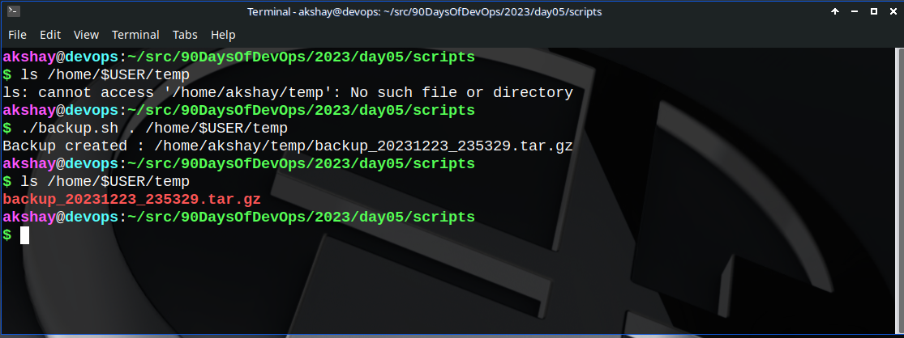
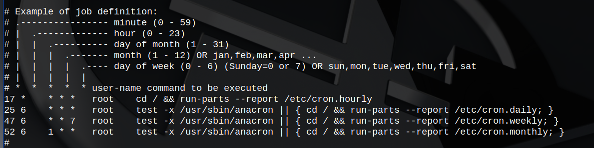
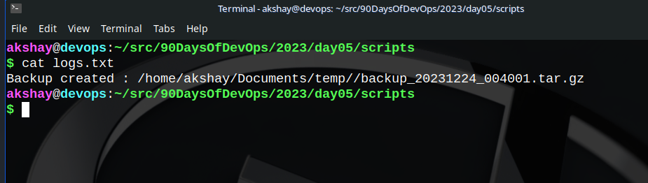

## 1\. Write a shell script to create multiple directories in the working directory.

The command should be executed in this way:

`./directories.sh <dir_name> <start_num> <end_num>`

```bash
#!/usr/bin/env bash

# a script to create directories from user args. 
# An additional functionality to delete the created directories is added at the end. Just in case you actually try it...😉
# Example to run this, ./directories.sh day 01 90

curr_path=$(pwd)
dir_name=$1
start_dir=$2
end_dir=$3

if [ -z $1 ] || [ -z $2 ] || [ -z $3 ]; then
    printf "Invalid format : The correct format is\n ./directories.sh <name> <start> <end>"
    exit 0
fi

if [ $start_dir -gt $end_dir ]; then
    printf "Invalid input : Starting index greater than ending index.\n"
    exit 0
fi

# function to create directories as required in the problem statement
create_dirs() {
    counter=$start_dir
    while [ $counter -le $end_dir ]
    do
        path="$curr_path"/"$dir_name""$counter"
        mkdir -p $path
        ((counter++))
    done
}

# function to delete the directories created above
delete_dirs() {
    counter=$start_dir
    while [ $counter -le $end_dir ]
    do
        path="$curr_path"/"$dir_name""$counter"
        if [ -d $path ] && [  $counter > $end_dir ]; then
            rm -rf $path
            continue
        elif [ ! -d $path ]; then
            printf "$path does not exist\n"
        fi
        ((counter++)) 
    done
}

# uncomment the functions to call
create_dirs
# delete_dirs
```

The above script is commented out as and where required. Rest is mostly the syntax for bash.

## 2\. Create a Script to backup all your work done till now.

```bash
#!/usr/bin/env bash

source_dir=$1
backup_dir=$2

mkdir -p $backup_dir

time_stamp=$(date +'%Y%m%d_%H%M%S')
backup_file_name="backup_${time_stamp}.tar.gz"

tar czf "${backup_dir}/${backup_file_name}" "$source_dir"

if [ -d $backup_dir ]; then
    printf "Backup created : ${backup_dir}/${backup_file_name}\n"
fi
```

The above script does the following:

1. Takes command line args as paths to the source folder and the destination folder to store the backup at.
    
2. Creates the destination folder if it doesn't exist already.
    
3. Generates date and time stamp and stores in a variable `time_stamp`.
    
4. Creates a folder with the name `backup_<time_stamp>.tar.gz` in a compressed form (specifically - tar.gz).
    
5. Executes the command to compress and save the source folder to the destination folder.
    
6. Checks if the backup directory has been created or not, then prints the message to the user.
    



## 3\. Read About Cron and Crontab, to automate the backup Script

<div data-node-type="callout">
<div data-node-type="callout-emoji">💡</div>
<div data-node-type="callout-text"><strong>Cron</strong> is clock daemon that runs as <strong><em>scheduled </em></strong>in a file which can be accessed using the command <code>crontab -e</code> in UNIX based operating systems.</div>
</div>

<div data-node-type="callout">
<div data-node-type="callout-emoji">🥶</div>
<div data-node-type="callout-text">Crontab is an <strong>interface</strong> where a user can write the automation tasks by mentioning other details like time, date, task to execute, etc.</div>
</div>

NOTE:

* Each line in crontab is composed of six fields separated by spaces, the above mentioned details.
    
* The syntax to write a crontab can be found in its manpage or in the `/etc/crontab` file. I was unable to find the later when on Arch linux, however, it's there in debian family.
    
* To list it down, the **six** fields in crontab from left to right are as follows:
    
    1. 
        
        Minutes (0 - 59)
        
    2. Hour (0 - 23)
        
    3. Days of the month (1 - 31)
        
    4. Month (1 - 12)
        
    5. Days of Week (0 - 6) *(where 0-&gt;sunday, 1-&gt;monday, ...) OR directly sun, mon, tue, wed, thu, fri, sat*
        
    6. Command to execute
        
* ```bash
          * 0 * * * bash /home/akshay/src/90DaysOfDevOps/2023/day05/scripts/backup.sh /home/$USER/src/90DaysOfDevOps/2023/day04 /home/$USER/Documents/temp/ >> /home/$USER/src/90DaysOfDevOps/2023/day04/logs.txt
    ```
    
* What the above crontab command does is execute the command with the required format and then save the logs to a logs.txt file
    
    
    

### 4\. User management in Linux

One of the most important skills a system admin must have is that of `User and Group administration in Linux`.

#### Managing Users

A user must authenticate to any system in order to access any of its resources. This access provides access to a customized user-specific environment.

1. The `/etc/passwd` file :
    
    * User account information is stored in this file. It includes fields like account name, home directory location, default shell along with some other values.
        
    * Syntax : `username:password:UID:GID:comment:home:shell`
        
    * For e.g. `root:x:0:0:root:/root:/bin/bash`.
        
2. The `/etc/shadow` file :
    
    * A security measure to the previous password storage in /etc/passwd file itself.
        
    * This file is readable by root only. (Try "catting" it out. It will show **permission denied error**.
        
3. Modify user permissions, create and delete users :
    
    The following commands are used for above operations -
    
    * `useradd` -&gt; to add a user
        
    * `usermod` -&gt; to modify a user's permissions
        
    * `userdel` -&gt; to delete a specific user
        

#### Managing groups

1. Groups came later on to cater the role-based needs in industries of large-scale projects where multiple user accounts needed the same type of accesss.
    
2. In order to ease the task of individually allocating permissions to each user and removing when he's not required, a group is created with specific permissions. New user accounts are added to the group as per the requirement. Also, when a user is not supposed to access a specific resource anymore, that user is simply removed from that group.
    
3. Here the information is stored in `/etc/group` file.
    
    Syntax : `groupname:password:GID:group members`
    
4. The commands for group operations are:
    
    * `groupadd` -&gt; create a new group
        
    * `groupmod` -&gt; modify a group definition on the system
        
    * `groupdel` -&gt; delete a group
        

Thus, it is pretty certain that user and group management in linux is pretty important from **security** perspective.

### Happy Learning ;)