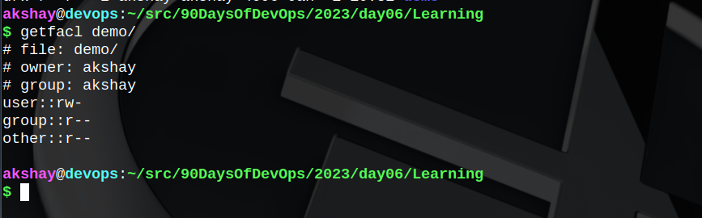

One line I remember clearly from my Operating Systems course is -  
`Everything in Linux is a file.` Though it is incomplete and it is often corrected by adding, `if it is not a file, it is a process.` So yeah, two lines you might wanna carry for eternity 😉...

Even a directory is treated like a file, but for our reference, we call it a directory/folder. Anyway, diving into the topic henceforth.

## Permission Groups

Each file(and directory) has three user based permission categories:

* `owner` -&gt; applicable to owner of the file only and not impact the actions of other users
    
* `group` -&gt; applicable to only the group(s) that has been assigned permission for a file and not impact actions of other users
    
* `all users` -&gt; applicable to all the users on the system
    

## Permission types

Every file(and directory) in Linux has three basic permission types:

* `read` -&gt; user can read contents of the file
    
* `write` -&gt; user can make changes to the file
    
* `execute` -&gt; user can execute/run the file or view contents of the directory
    

### **Viewing permissions of a file**

```bash
ls -l <path_to_file>
```

The permission in the command line is displayed as: ***\_rwxrw-r-- 1 owner:group***

1. **User rights/Permissions**
    
    1. The first character that is marked with an underscore is the special permission flag that can vary as follows:
        
        * `-` : regular files -&gt; e.g. **\-rwxrw-r--**
            
        * `d` : directory -&gt; e.g. **drwxrw-r--**
            
        * `l` : symbolic link -&gt; e.g. **lrwxrw-r--**
            
        * `c` : character special file -&gt; e.g. **crwxrw-r--**
            
    2. The following set of three characters (rwx) is for the owner permissions. Here, the owner can **read, write and execute** the file.
        
    3. The second set of three characters (rw-) is for the Group permissions. All members of the group have **read and write** permissions only.
        
    4. The third set of three characters (r--) is for All Users on the system/network permissions. Here all other users can have **read-only** access.
        
2. Following that grouping is the integer/number that displays the number of hardlinks to the file.
    
3. The last piece is the Owner and Group assignment formatted as `Owner:Group`.
    

## Modifying file permissions (chmod)

*(most used command for permissions)*

We use the command `chmod` to modify permissions of a file for the owner, a user/group/all users.

The permission groups used are:

* **u** -&gt; owner
    
* **g** -&gt; group
    
* **o** -&gt; others
    
* **a** -&gt; all users
    

The potential assigment operators **+** and **\-** are used to either add or remove specific permissions.

### Numeric references to permissions

This is basically the octal representation of permissions.

For e.g. `sudo chmod 640 file1` is equivalent to the owner having **read-write** permissions for file1, the group has **read** permissions, and all other users DO NOT have any permissions for the file1.

Thus **640** is equivalent to **\-*rw-r-----.*** You can think of it as octal representation of bits.

## Modifying file owner and groups (chown)

The `chown` command is used to change the user and/or group ownership of a file.

## Modifying groups

The `chgrp` command is used to change the group permissions of a file(or directory).\\

## Why permissions are important?

Windows or Mac users, may be unaware of these because those environments do not focus on user-based rights. However, on linux (being in a more secure world), this is given emphasis.

Certain important locations where permissions are ought to be set right -

* **bootloader config files** -&gt; If an unauthorized user makes changes/deletes a particular file, there might be issues during booting itself. It might make life miserable for beginners trying to fix it. Recommended mode - **700**
    
* **system config files** -&gt; Who would like their system configurations being messed up. It could interrupt your usual user experience. Recommended mode - **644**
    
* **network security - firewalls** -&gt; If you are aware of a firewall in linux - the `ufw`, then you might not question further why to protect it. If unaware, I recommend reading about a firewall. The firewall scripts, loaded during boot-time are best kept in mode - **700**.
    
* **MOST IMPORTANT** -&gt; You might not want anyone to mess with your corporate machine files.
    

## Access Control Lists

> Access Control Lists (ACL) is a list containing rules that specify whether a specific user or system trying to access a resource should be granted access or denied.

Two commands are generally used for ACL - `setfactl` and `getfacl`.

### setfacl

I created a "demo" directory for expermintation. It's permissions are as shown below.


### getfacl

The same can be obtained using getfacl command as follows :

```bash
getfacl demo/ # getfacl <path_to_file>
```



### Changing permissions using setfacl :


In the above picture, for the output of `ls -l`, the trailing **+** means extended permissions i.e. **acl permissions are set to the file.** So to check those, you need to try `getfacl demo/`.

To remove the trailing **+**, meaning to remove the extended permissions, do the following:


Removing all ACL entries to the file:

```bash
setfacl -b <path_to_file>
```


## Happy Learning ;)