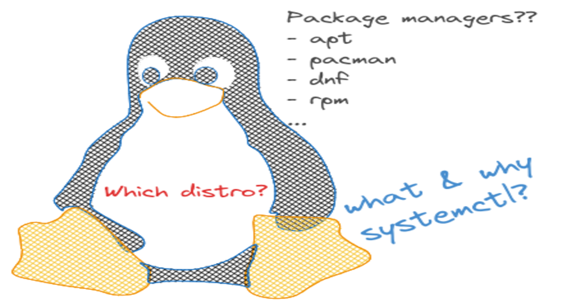
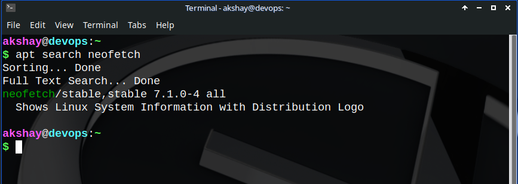
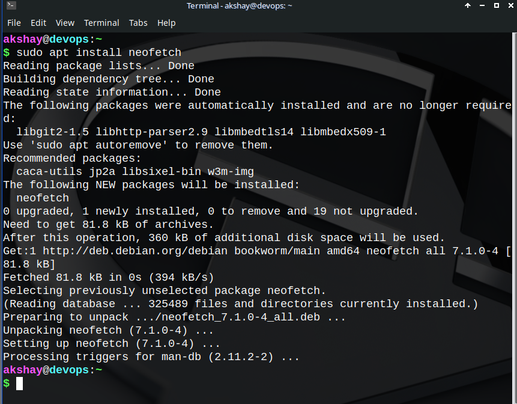
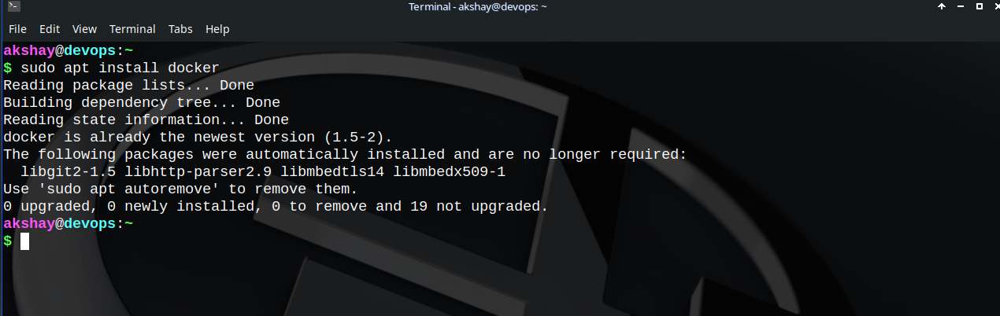
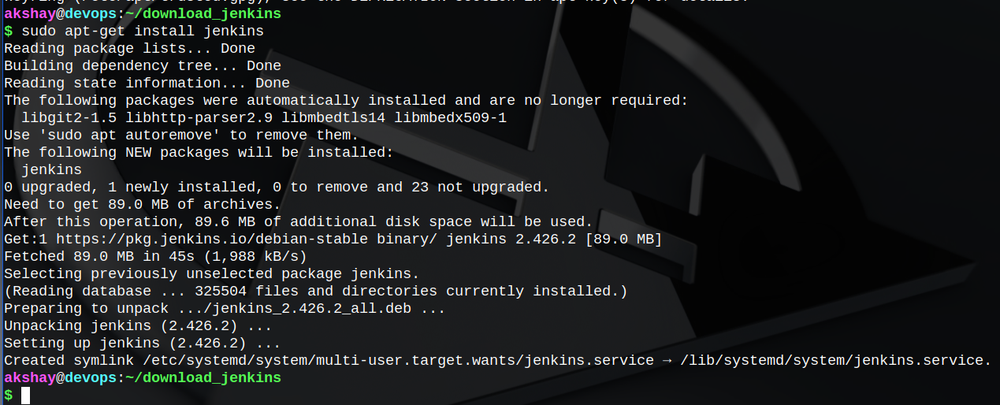
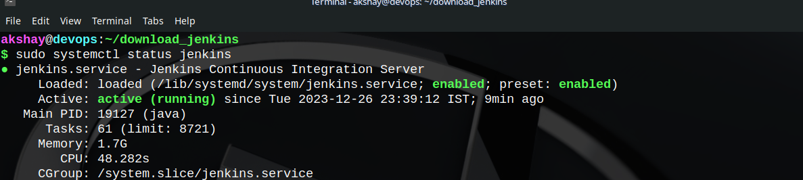
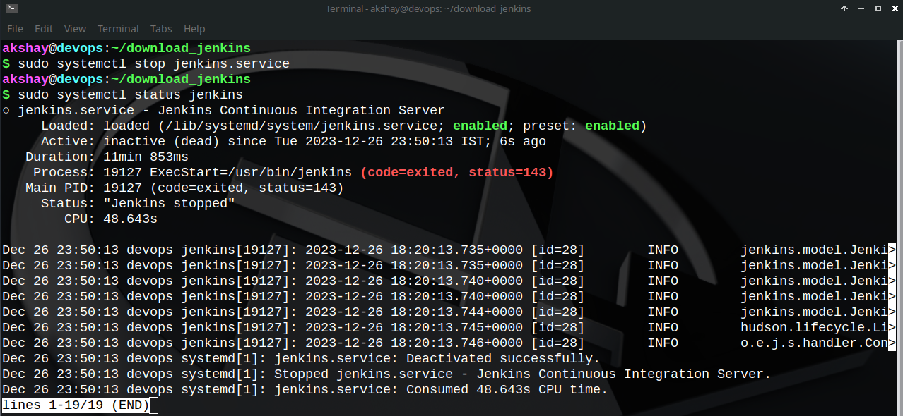

# Installing an application before Linux:

> Browser -&gt; enter search query -&gt; find relevant/trusted websites -&gt; find compatibility with device (64-bit, 32-bit, architecture, etc) -&gt; download -&gt; double-click -&gt; Agree T&C -&gt; **next-next-next... -&gt; install**

Pretty convenient, isn't it? 😒😒

## Installing a package on Linux/UNIX-based system:

```bash
sudo <package-manager> <command> <package-name>
```

For e.g. to download VLC media player in linux...

```bash
sudo apt install vlc    # on Debian-based distros
sudo pacman -S vlc      # on Arch-based distros
sudo dnf install vlc    # on Fedora-based distros
```

This installs the software directly on your machine. It is ready-to-use now. No more tedious long process to just install/remove/update an application.

### Formally defining a package manager:

<div data-node-type="callout">
<div data-node-type="callout-emoji">💡</div>
<div data-node-type="callout-text">A package manager in Linux is a software-tool which is assists in <strong>searching, downloading, installing, uninstalling</strong> and perform other <strong>software-management</strong> related operations like <strong>configuring, updating,</strong> etc.</div>
</div>

Thus, a package manager is a life-saver tool for system-adminstrators, devops and automation engineers and general developers who love Linux the most because of the comfort of `1. the command line` and `2. package managers`.

In the example above, **apt** is a package manager for Debian-based distros; **pacman** for Arch-based distros while **dnf** is for Fedora/RedHat based distros.

Since Debian-family is most known and I have been on Debian-based distros myself for a long time, I would like to explain the further part with **apt.**

### Installation of neofetch on Debian-based distros (apt package-manager)

Before proceeding, check if it is installed already.

```bash
neofetch --version
```

If the version is displayed, it is installed on your system, else if any error prompts, you gotta install it. Else, to check, you can also do `whereis neofetch` on your terminal.

1. Update the local list!!! (important so as to sync it with latest software versions on the Debian-mirrors)
    
    ```bash
    sudo apt update
    ```
    
2. Search for the keyword that may exist in the package name(here neofetch)
    
    ```bash
    apt search neofetch
    ```
    
    
    
3. If it shows positive results for the search, find yourself the complete name of the package. Here the one before the "/" character is the required package name. Following it is the status(stable) with version and other information is displayed. Now you simply have to take that name and install it:
    
    ```bash
    sudo apt install neofetch
    ```
    
    
    
4. Check if it is installed:
    
    ```bash
    neofetch --version
    ```
    

## Tasks:

### Install Docker

* Having followed the above steps, docker can be easily installed.  
    Since it was already installed on mine, I didn't do the process again, it's only typing actually :)
    
* 
    

### Install Jenkins

The installation process of Jenkins is pretty different as package for Jenkins is not available yet. Still it pretty well documented on their [official website](https://www.jenkins.io/doc/book/installing/linux/).  
The final status of successful installation as reached by following the steps mentioned on the official website is as shown in the image below.



## Systemctl and systemd

Very well, I didn't expect that to come like that in this course, but yeah I will post a link to a blog that I have already published on [<mark>dev.to</mark>](https://dev.to/akshay_khoje/systemd-vs-sysvinit-initializing-the-system-5h71)<mark>.</mark> This blog is actually a sequel to this one right here - [<mark>error</mark>](https://dev.to/akshay_khoje/system-has-not-been-booted-with-systemd-as-init-system-pid-1-5e1d)<mark>.</mark>

Make sure to read throught it as well :)

## Stop the service Jenkins and post screenshots

Before:



After:



Thus, Jenkins service has stopped.

It was a little heavy learning today I suppose, but it's just beginning... It's only getting interesting as we progress. See you on the next one 🤗.

## Happy Learning ;)