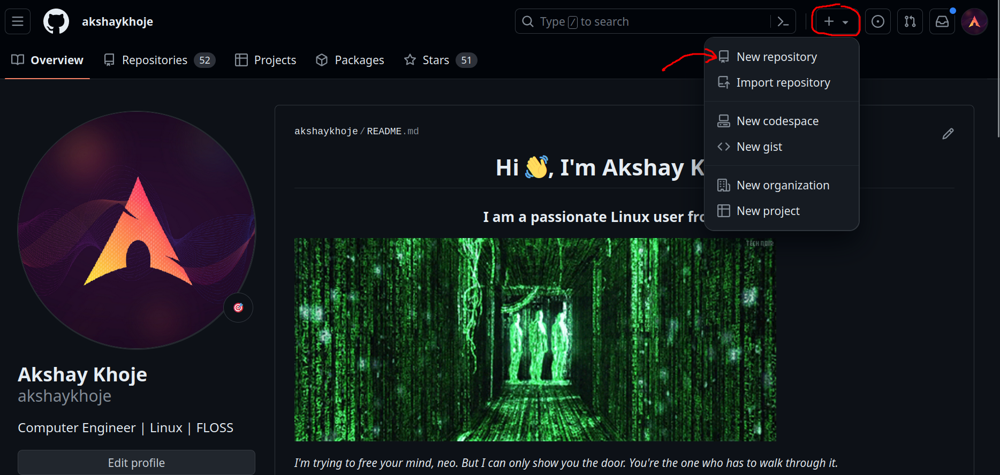
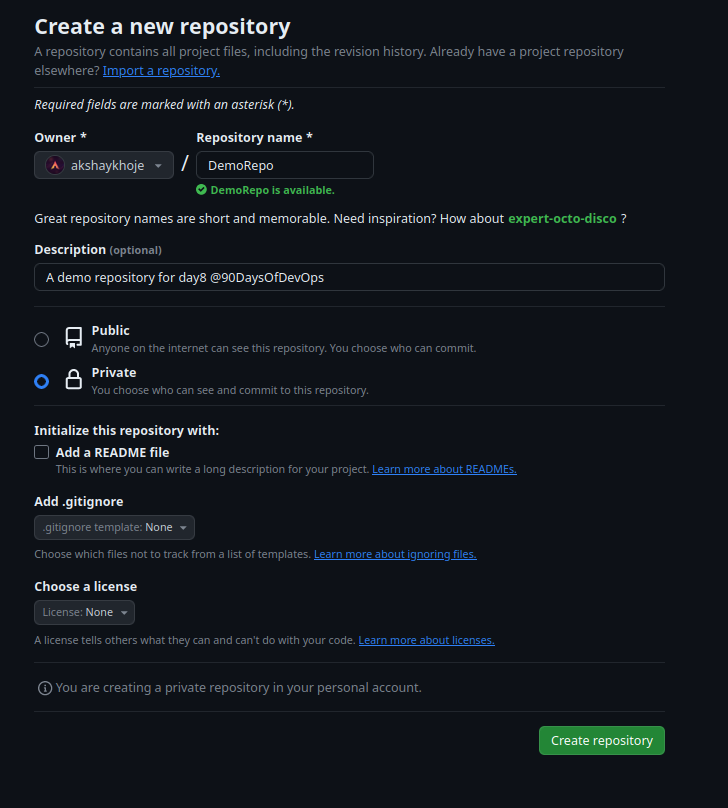
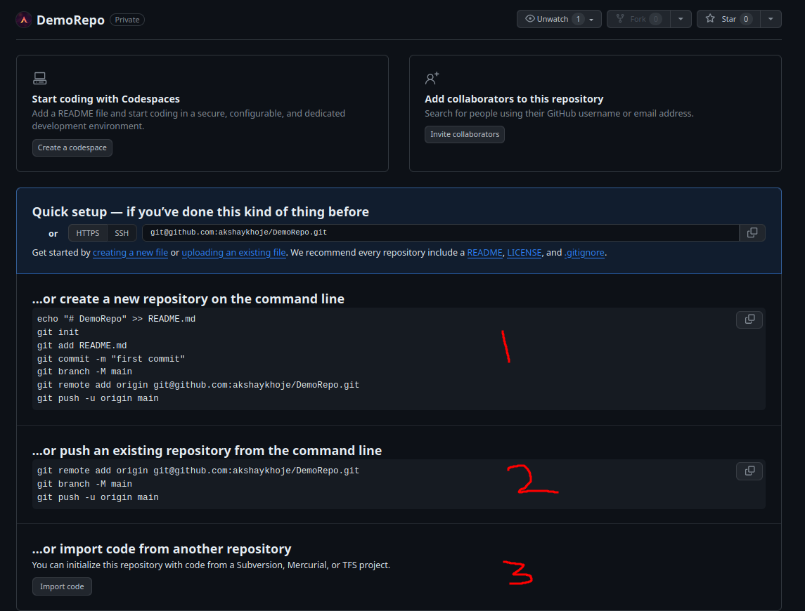
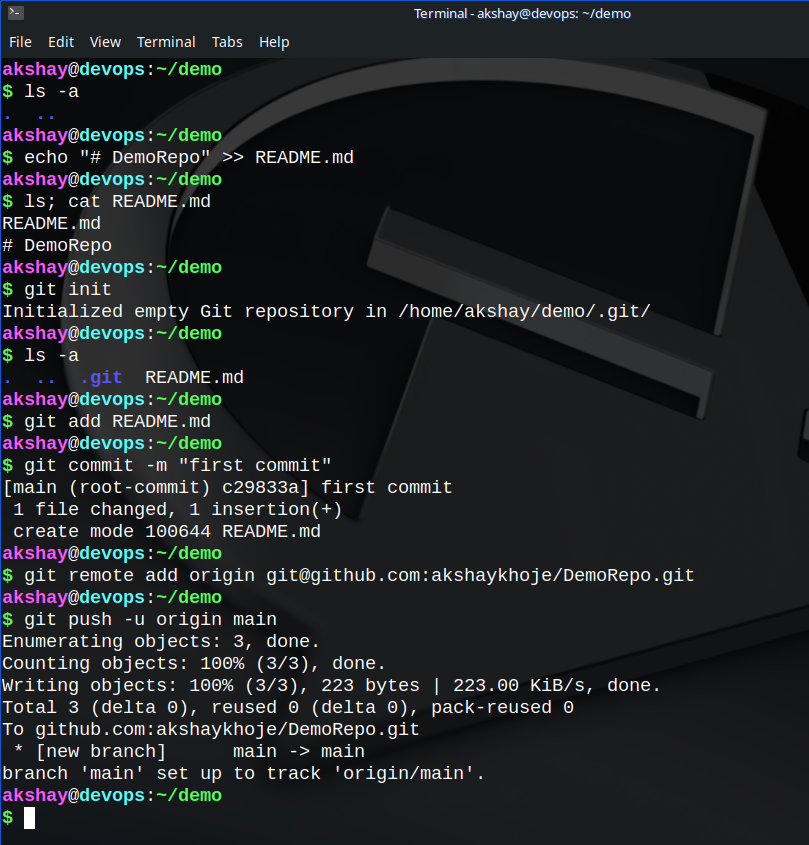
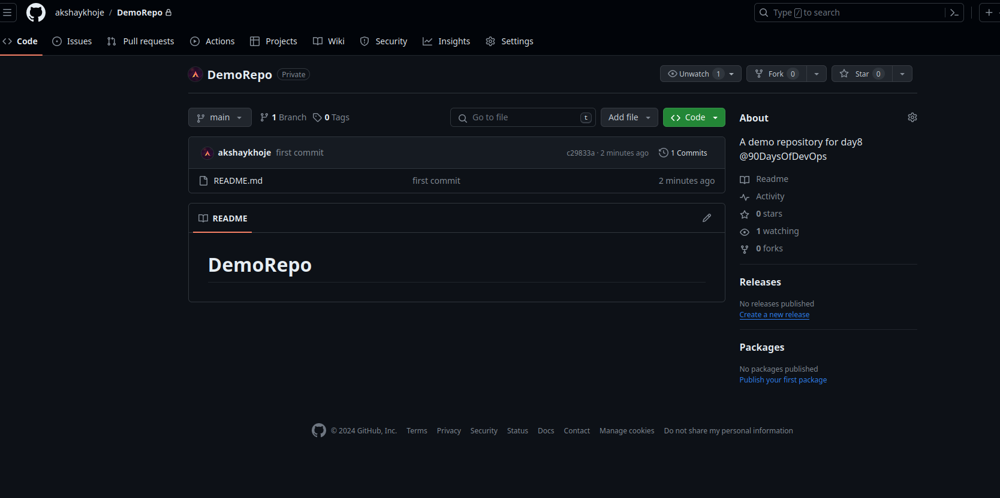

*<mark>When "Why" is clear, then "How" is easy.</mark>*

In this blog, we'll look at the **"why"** part of **using version control**. The **"how"** will be discussed later.

## Why Git?

Consider a scenario where multiple people want to work remotely on a project. This can be conveniently achieved if the project is hosted on a central repository or a shared cloud-space. 

Let's say tasks are delegated to team as follows:
| Person    | Feature  |
|:--------: | :-------: |
| P1        |   F1    |
| P2        |   F2    |
| P3        |   F3    |

It is not necessary that to attain their respective features, they are not going to touch each other's files or some common file. There might arise a situation when P1 has made changes in file1 and P2 is also making changes to file1 at the same time. So, the changes may go un-synchronized or un-recognized by either of them. It can also lead to several other problems in the development process as we'll see as we proceed with the **Version Control** discussion in the near future.

Looking at the above scenario, it is pretty obvious that in real-life software development and maintenance process there may be multiple developers working parallely on the same project - sometimes perhaps making changes to the same file. This is one major reason where **version-control** comes to the rescue - i.e. to <mark>***track changes in the code*** </mark>.  Thus there arose a need for a reliable **Version Control System(VCS)** for overall `code management`.

A popular hacker of great trust, Mr. Linus Torvalds invented **GIT**, a Free and Open Source Software (FOSS) in the year 2005; the same man who gave us the Linux kernel that drives almost all the servers that keep the internet and the digital world running today.

Click👇 the image below to listen to The Big Brain...

[](https://youtu.be/o8NPllzkFhE)

## What is Version Control System(VCS)?

<div data-node-type="callout">
<div data-node-type="callout-emoji">💡</div>
<div data-node-type="callout-text">A version control system is a software that is used to <strong>track changes</strong> made in a project to each and any file where each specific change tracked may be called a <strong>"version"</strong>.</div>
</div>

### Types of VCS (common ones):

1. #### Centralized VCS
    

* This is the type of VCS where there is one central repository, to which all the users are connected to. This central repository can be a developer's machine or a dedicated server.
    
* This type is generally used by those teams where a sngle user uses a fixed physical machine and less likely to move away from it.
    
* e.g Subversion(SVN), Concurrent Version Systems(CVS)
    

2. #### Decentralized/Distributed VCS
    

* This type of VCS allows physically users working with multiple computers to work collaboratively with other developers remotely.
    
* Here, each user fully mirrors or owns a snapshot of the remote repository locally on their machine. So, if in case the server becomes unavailable, any client repository can send its version to any other client needing it or back to the server.
    
* e.g. **Git**
    

## What is Git?

Git is a decentralized, [Free and Open Source Software(FOSS)](https://www.gnu.org/philosophy/free-sw.html) version-control system(VCS).

* It is commonly used for collaborative working among software developers.
    
* It is used for version tracking and reverting back-and-forth among various "versions" as per the requirement.
    
* It can be conveniently used to resolve merge conflicts.
    

#### A short video on [<mark>FOSS</mark>](https://static.fsf.org/nosvn/FSF30-video/FSF_30_720p.webm)

---

## What is GitHub/GitLab?

GitHub/GitLab is a web-based platform that hosts version control system using Git.

* GitLab is a pure FOSS tool i.e. it is openly available for a user to run locally, study the program, redistrubute the code, make changes to its source code and redistribute to the public who can practice the same freedom.
    
* GitHub on the other hand is a subsidiary of Microsoft and is a closed-source platform. However, it is a very popular platform among developers due to its large infrastructure and funding.

### Creating a github repository

To install and setup git on your linux machine, checkout the following docs:
https://git-scm.com/book/en/v2/Getting-Started-Installing-Git

1. Navigate to https://github.com
2. As shown in the image below, click on the "+" sign to get a drop down menu. Click on "New repository".

- 

3. You will be redirected to a page shown below.
    - Enter the repository name of your choice.
    - Add a description if you want.
    - If you want to keep the repository visible to everyone, select `Public`, else `Private`. Here since I am creating this repository for demo, I have kept it private.

- 

4. Click on `Create repository` in the bottom right.

5. You will be redirected to a page like this.

- 

6. In the above image, the numbers marked 1, 2 and 3 in red are for different use-cases.

Here, I have assumed you have not created a Git repository before.
    
1. **…or create a new repository on the command line**
Enter in your terminal the lines given in the field corresponding to number "1".

| command                               | meaning                       |
|:--------                              | :-------                     |
| echo "# DemoRepo" >> README.md        |   write to README.md file    |
| git init                              |   initialize a git repo locally    |
| git add README.md                     | add the README.md file to tracking |
| git commit -m "first commit"          | make your first local commit       |
| git branch -M main                    |       set main branch             |
| git remote add origin git@github.com:akshaykhoje/DemoRepo.git | add the remote repository link | 
| git push -u origin main        | push to main branch of remote repository |




Now hit refresh in the browser. You will be able to see the remote repository.



2. **…or push an existing repository from the command line**
Do this if you have an existing git repo locally that you want to maintain a remote respository too.
```
git remote add origin git@github.com:akshaykhoje/DemoRepo.git
git branch -M main
git push -u origin main
```

The "3rd" one is used when code is to be imported from another repository.


We'll discuss the actual **practical part** in the later posts when we'll dive deep into Git and VCS 😎.

### Happy Learning ;)