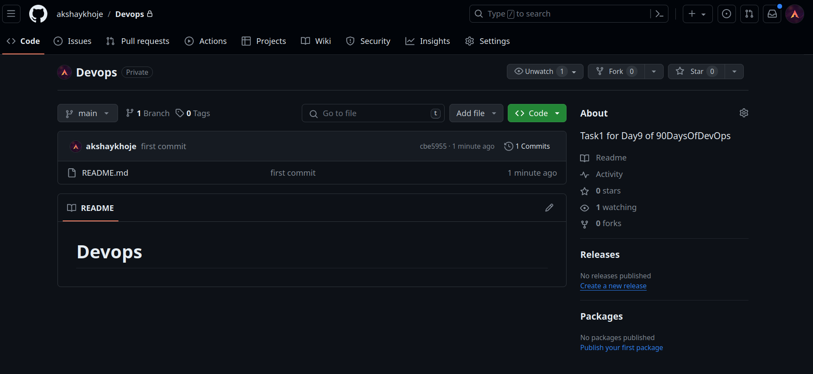
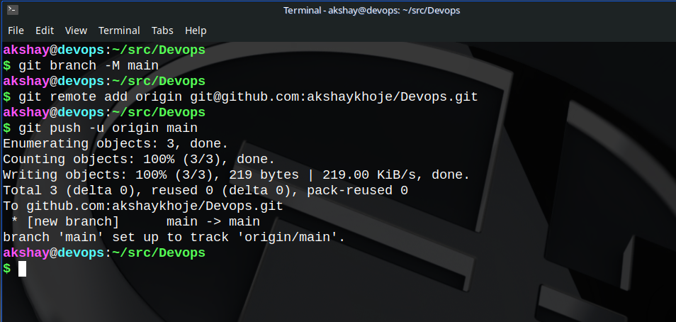
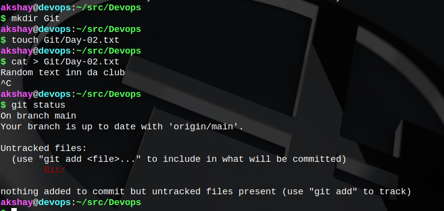
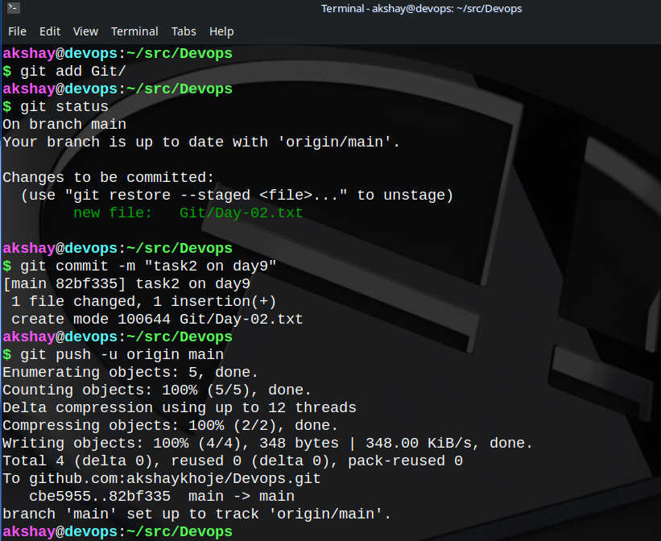

<div data-node-type="callout">
<div data-node-type="callout-emoji">😌</div>
<div data-node-type="callout-text"><em>This is the beginning of</em><strong><em> "HOW" </em></strong><em>part of version control systems. To check out the </em><strong><em>"WHY", </em></strong><em>visit my </em><a target="_blank" rel="noopener noreferrer nofollow" href="https://akshaykhoje.hashnode.dev/day-8-basic-git-github-for-devops-engineers" style="pointer-events: none"><em>blog for day8</em></a><em>.</em></div>
</div>

## 1\. What is Git and why is it important?

* Git is a distributed version control system. It is used in software development process to make version management and `software-code management` simple and developers life easy as `rolling back-and-forth between versions/branches` of code is just few commands away.
    
* Git is important as it keeps track of each and every change made in a project. It provides certain features like:
    
    * **Collaborative working**
        
    * **Branching**
        
    * **Roll back & forth among versions**
        
* In summary, Git is a tool of great convenience for software development and maintenance.
    
* To know more on "WHY Git is important", checkout my [previous blog](https://akshaykhoje.hashnode.dev/day-8-basic-git-github-for-devops-engineers).
    

## 2\. What is the difference between Main branch and Master branch?

* The difference between **master** and **main** branch on GitHub is solely a matter of naming convention, i.e. it's the same thing earlier called "xyz" is now called "abc".
    
* Upon digging a bit, I encountered some writings which mentioned the inflection of the "master" branch as the MASTER to some SLAVE branches leading to a cultural conflicts. It is said to have caught decent attention of developers back when it happened. This could be one reason for the change. ([source](https://www.theserverside.com/feature/Why-GitHub-renamed-its-master-branch-to-main))
    
* The **main/master** branch represents the central line of development in a repository.
    
* It is the reference line to track software software on various branches made and merged/deleted after making changes to it.
    

## 3\. Can you explain the difference between Git and GitHub?

| Git | GitHub |
| --- | --- |
| It is a **version control system** (a software) used to manage and track a software. | It is a **web-based platform** that uses Git(a VCS) to for version control. |
| It is Free and Open Source Software. | It is a proprietary hosting platform/service. |
| Installed locally on your machine. | Being web-based, it cannot be installed locally. Need an account though. |
| Used to track code locally. | Host the Git repositories online and make available for collaborative/private use. |

## 4\. How do you create a new repository on GitHub?

Refer my blog here for the creation of a new repository on GitHub.  
Link to blog : [https://akshaykhoje.hashnode.dev/day-8-basic-git-github-for-devops-engineers#heading-creating-a-github-repository](https://akshaykhoje.hashnode.dev/day-8-basic-git-github-for-devops-engineers#heading-creating-a-github-repository)

## 5\. What is difference between local & remote repository? How to connect local to remote?

***repository :*** *a place or a container which can holding something in large quantities*

***git respository :*** *a repository which is being version-controlled using GIT*

#### **LOCAL REPOSITORY :**

* It is located on the working machine where a developer may be working on a project. Could be your laptop, PC, office-computer, etc.
    
* To check if a project is using `git` for version control, check if it has a **hidden folder named** `.git` in it's root directory. It it exists, it is using Git.
    

#### REMOTE REPOSITORY

* A remote repository is just a Git repository hosted on some network on a distant machine.
    
* It comes into play when collaborative work is required OR when you intend to share your work with others.
    

#### Connecting a local repository to a remote repository

* Enter the following command by navigating to the local git repository.
    
* The *link\_to\_remote\_repo* ends in **".git".** We have done it while creating a repository on GitHub in my previous blog.
    
    * ```bash
            git remote add origin <link_to_remote_repo>
        ```
        
* To check if a local repository is connected to a remote repository or not, type the following command:
    
    * ```bash
            git remote -v
        ```
        

## Tasks

### 1\. Task-1

* ### Set your user name and email address associated with your commits:
    

```bash
git config --global user.name "username"
git config --global user.email "id@gmail.com"
```

### 2\. Task-2

* ### Create a repository named "Devops" on GitHub
    
* 
    
* ### Connect your local repository to the repository on GitHub.
    
* 
    
* ### Create a new file in Devops/Git/Day-02.txt & add some content to it
    
* 
    
* ### Push your local commits to the repository on GitHub
    
* 
    

### Happy Learning ;)