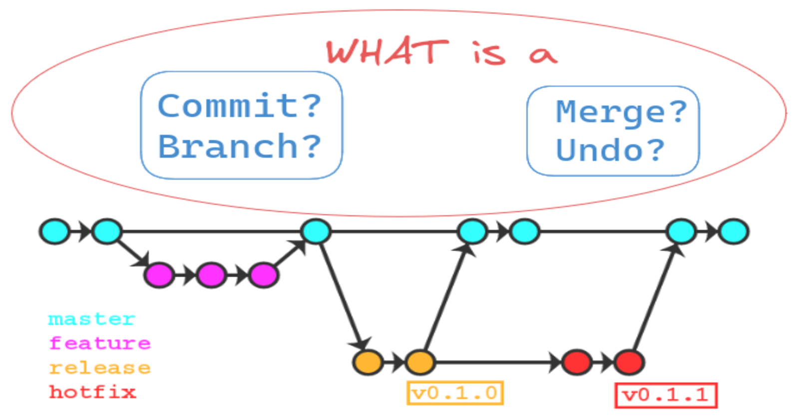

# Day 10 - Advance Git & GitHub for DevOps Engineers
## 90DaysOfDevOps

Today, we'll look into some essential Git commands that are required during a project. For a first time reader this may involve <s>advanced</s> concepts, but I have tried to simplify stuff as much as possible.

**Let's get started...**

We have two tasks lined up today :

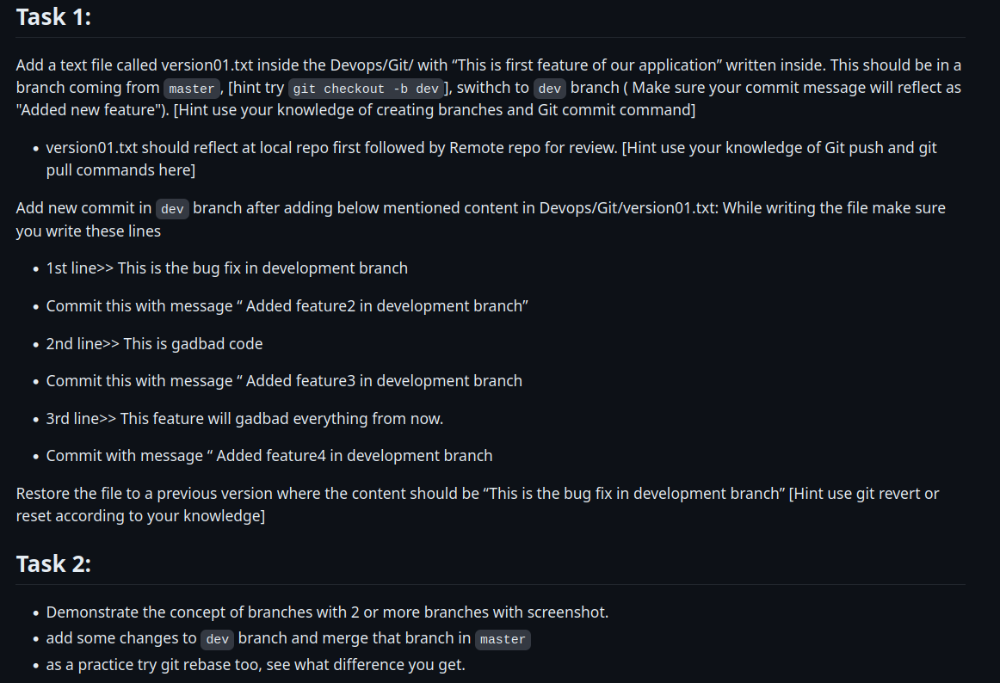

## **Before the tasks, a little build-up.**

Consider a real example of contributing to a project. I'll give you one where I wanted to contribute to a project - "neofetch". Check the actual repository [here](https://github.com/dylanaraps/neofetch).

> Neofetch is a command-line system information tool. I wanted to add one more feature to it, i.e. to also print the "Display Manager" i.e. **sddm**, **gdm** or **lightdm**, etc along with the other info.

Although I succeeded in doing so, one final step is remaining for it, i.e. the alignment. Rest all the work is done I believe (at the time of writing). It's been months the issue has not been responded though 😐.

The currnet status of the program is :

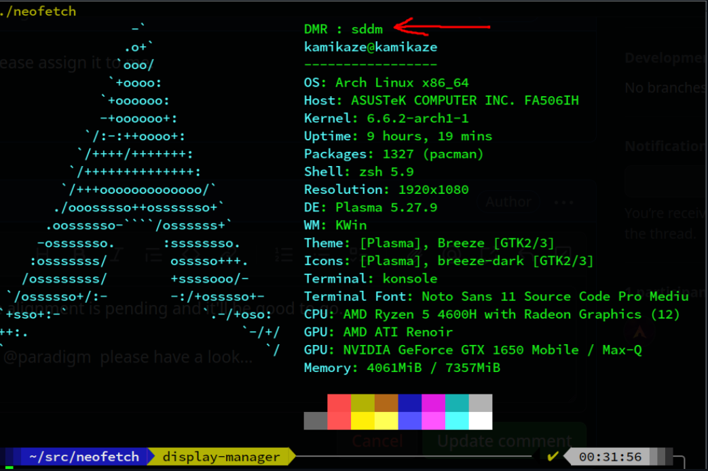

And this is the link to the [issue](https://github.com/dylanaraps/neofetch/issues/2420).

---

Now, this could be a project in your workplace where you are supposed to contribute/work. Some questions...

### How do I start working on an existing project?

Steps to get started:

1. Go to the URL of the project and **fork**.
    
    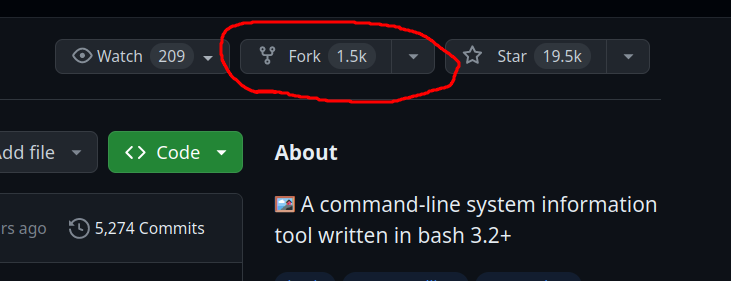
    
2. **Clone** the repository that you have forked.
    
    1. The forked repository is now visible on your GitHub/GitLab account.
        
    2. Visit the forked repo URL and click on "Code" in green button.
        
        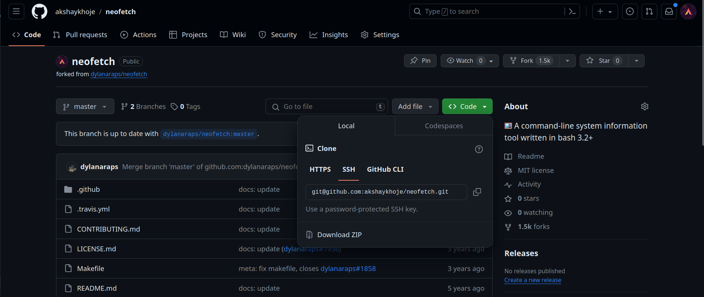
        
    3. Then copy the link either SSH or HTTPS as per your preference. If you haven't setup SSH, select HTTPS and copy the link.
        
        1. Navigate to the directory you want to store your project in. (I created a "temp" directory in my home folder.
            
        2. Enter the command :
            
            ```bash
            git clone <the_copied_link.git>
            ```
            
            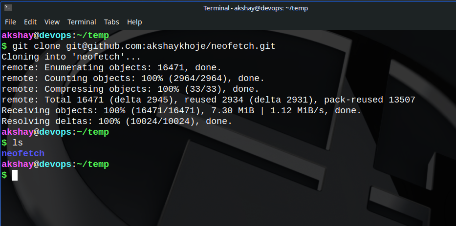
            
3. Create a **branch** with a name suitable to the feature you want to add (for convenience).
    
    1. Now you have a copy of the project on your local machine to work. Naviate to the project.
        
    2. Check all the branches in the cloned repository with the command :
        
        ```bash
        git branch -a
        ```
        
        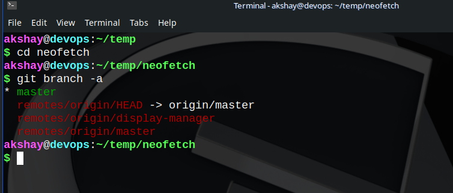
        
        1. Here, you might get only one branch in white i.e. `origin/master` or `origin/main`. The second branch `remotes/origin/display-manager` is because I have already worked on that branch earlier.
            
        2. To switch to the branch where I worked on, the following command
            
            ```bash
            git checkout display-manager
            ```
            
            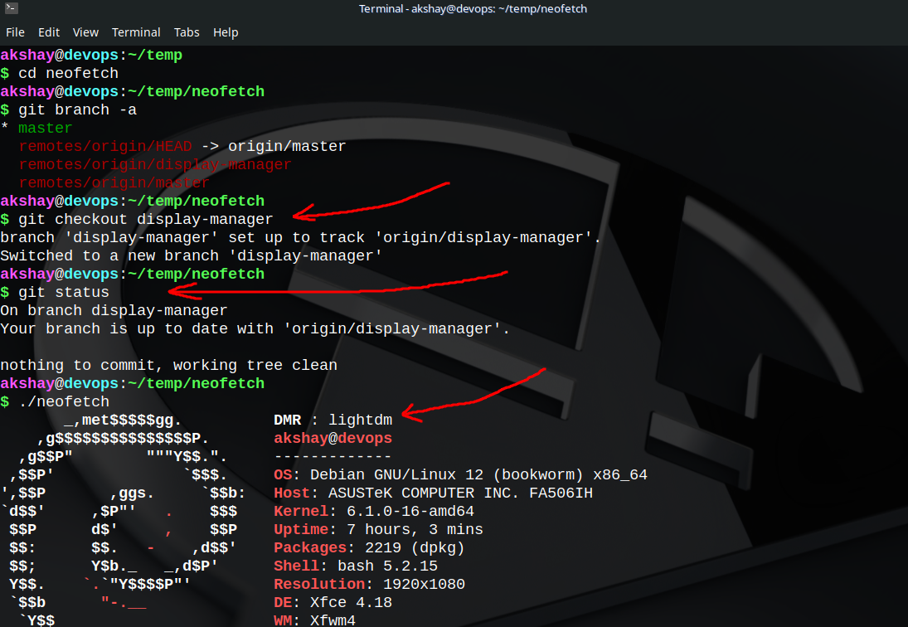
            
        3. If you want to work on a new feature altogether from the project on the main/master branch, do the following:
            
            ```bash
            git checkout -b new_branch
            ```
            
            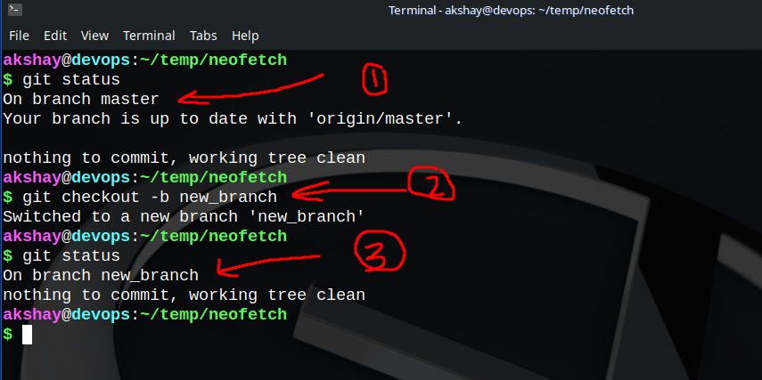
            
            * In (1), I show that I have switched back to the master/main branch - the central working line of a project.
                
            * In (2), I create a branch with all the code that exists on the master branch and checked out from master to the new branch, i.e. after the command I will be on `new_branch`.
                
            * In (3), I displayed using `git status` that I have switched to the `new_branch` successfully.
                
        4. Make whatever changes you want to in the project on this branch and push the changes as follows.
            
            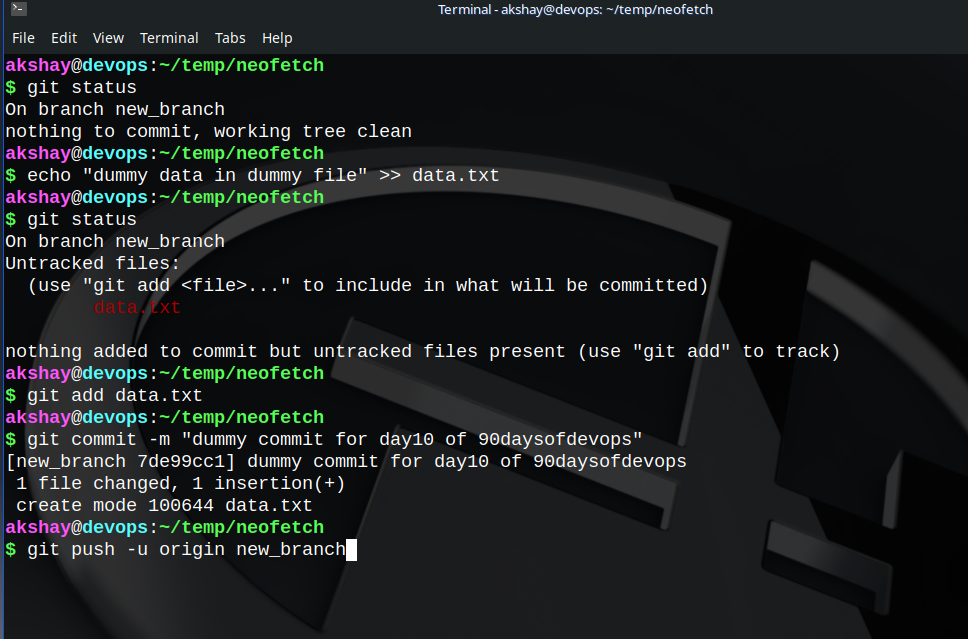
            
            * Thus, the changes made to this branch will be pushed to the new\_branch remote branch on your github/gitlab wherever you cloned it from.
                
            * Then there will reflect an option to send a "Pull Request" to the original repo where you forked it from.
                
            * Click on `Pull Request` if you want to get the changes merged in the original project.
                
            * Then the owner of the project will do the next steps of checking and verifying the code, etc.
                
        5. Congratulations, you have understood how to contribute to an open source project!
            

## What is a commit?

<div data-node-type="callout">
<div data-node-type="callout-emoji">💡</div>
<div data-node-type="callout-text">A commit in git can be thought of as an image or a version with certain changes in the code attaining small/large milestones.</div>
</div>

To make a commit:

```bash
git commit -m "short description/message of the changes made for reference"
```

## How do I check the commit history?

```bash
git log
```

Okay, now that you have understood the basic commands of using Git and GitHub/GitLab, you might someday want to undo a particular commit or go back to a specific version and just work around something, trust me this will come to you right✅.

## How to undo a commit?

There are several ways to undo git commit(s). The best practice for doing so is to use the `git revert` command even if the changes have been pushed to the remote repository. The other popular approach to undo a commit is `git reset`. There are slight differences and may be used appropriately to maintain certain coding standards/documentation purposes of the project.

1. **git reset**
    
    1. **soft reset**
        
        ```bash
        git reset --soft <commit_ID1>
        ```
        
        * The command resets the HEAD commit on a local branch to a previous commit.
            
        * The specified version is now the current commit and the **HEAD** version in the log.
            
        * The commits after the **commit\_ID1,** i.e. the more recent commits are discarded.
            
        * Useful to undo accidental commits.
            
        * `soft reset` is not ideal if the changes have been already pushed to the remote repository.
            
    2. **hard reset**
        
        ```bash
        git reset --hard <commit_ID2>
        ```
        
        * The command resets the HEAD commit on a local branch to a previous commit just like it does for **soft reset.**
            
        * The difference is that any changes made to file(s) after the **commit\_ID2 are lost.** 👀
            
        * > Use when certain changes are NOT AT ALL required in the future or is to be discarded totally!
            
        * This approach is NOT recommended when changes have been already pushed to a remote repository.
            
2. **git revert**
    
    * Used to completely revert a commit without deleting it i.e. it doesn't throw away or overwrite any earlier commits.
        
    * Point of difference between reset and revert is that, `git revert` undoes the changes with a new commit.
        
    * Maintains history of all commits while adding a new entry to the commit log to document the reversion.
        
    * The `HEAD` of the project is set to this new version that inverted the changes.
        
    * Useful and recommended when changes have been pushed to remote repository as it is the cleanest way to fix breaking changes.
        

## Can I merge two branches?

| Is the question valid? | Yes |
| --- | --- |
| Answer to the question | Yes |

Let's say you are working on a branch `featurebranch1` different from the `main` branch. You now want to add your local `featurebranch1` commits to the **HEAD** of the `main` branch.

There are two ways you can merge the two branches together or attain the above :

1. **git merge**
    
    * This method creates a new commit that incorporates the changes from both branches.
        
        ```bash
        git checkout main
        git pull
        git checkout featurebranch1
        git merge main
        ```
        
    * Makes it difficult to review your code
        
2. **git rebase**
    
    * Allows integration of two branches together into one of the two branches.
        
    * Logs are modified once the action is completed.
        
    * It takes a series of commits from one branch and applies them on top of another base commit basically rewriting a branch's commit history.
        
    * Does not change the commit content of your commits, but it `does change the commit hash` used to track your changes.
        
        ```bash
        git checkout main
        git pull upstream main
        git checkout featurebranch1
        git rebase main
        ```
        
    * <div data-node-type="callout">
        <div data-node-type="callout-emoji">💥</div>
        <div data-node-type="callout-text">Bad idea to use <code>git rebase</code> for a commit that <strong>somebody else </strong>might have based their work on!</div>
        </div>
        
    * Only change your own local history - ideally don't rebase anything that you have already pushed to an upstream branch.
        

## Tasks

### Task1

* The following image is to show branching and setting upstream the remote repository for dev branch.
    
* 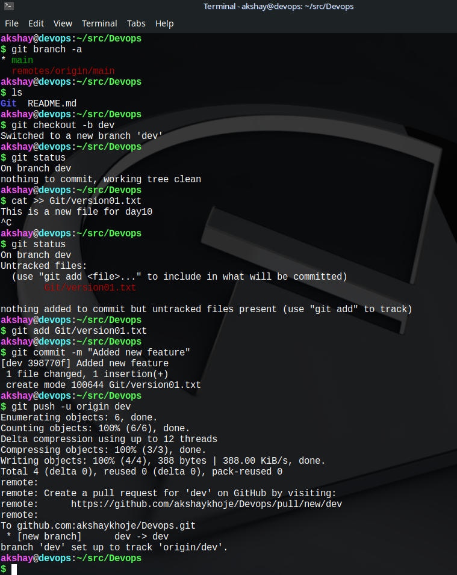
    
    You can see the commits in the following image:
    
    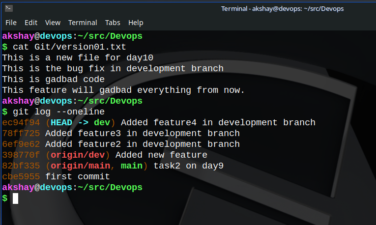
    
* **A bit deflection while doing this task:**
    
    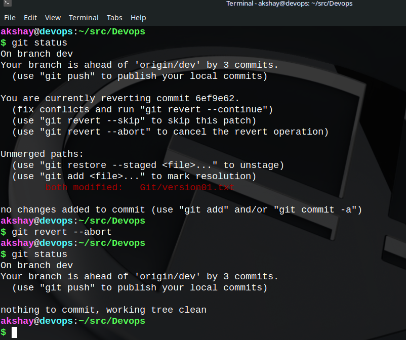
    
    * Here, I got some sort of conflicts. It is solved in the image itself by aborting the reversion.
        
* Coming back to the actual solution...
    
    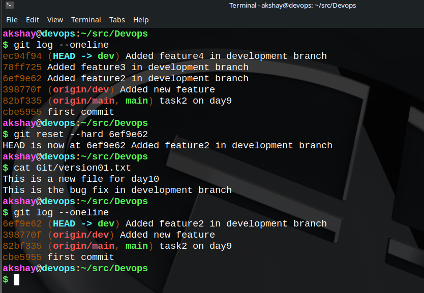
    

### Task2

* All the branches can be seen using the `git branch -a` command shown early up in the blog.
    
* 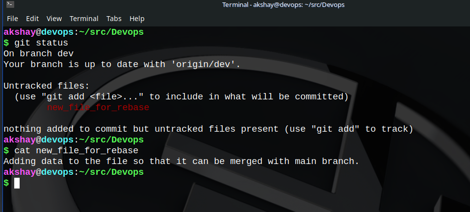
    
    Thus, changes have been made to the dev branch by adding the `new_file_for_rebase` file as shown above.
    
* 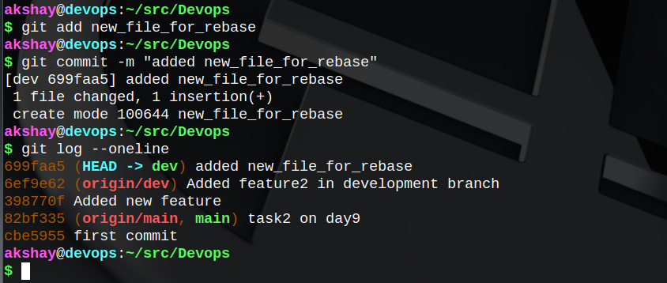
    
    Successful merging and push to main branch
    
* 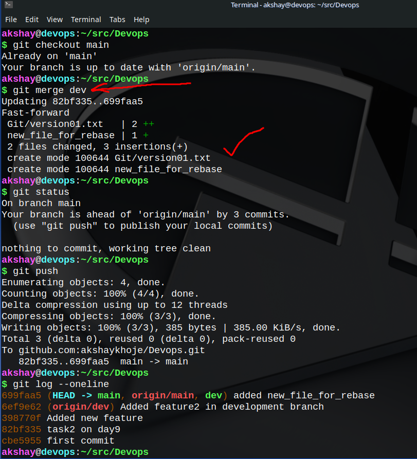
    
    Now, to try out the `git rebase` command, I have deleted the **new\_file\_for\_rebase** from the dev branch and I want to merge the dev branch with the main branch using `git rebase`.
    
* 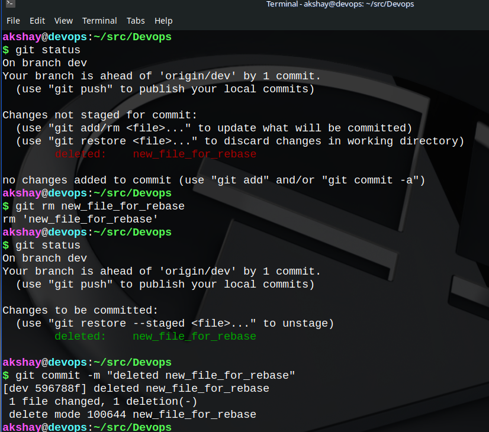
    
    To display that main branch has been rebased(merged using **rebase**), check the image below:
    
* The command used is `git rebase dev main`
    
* 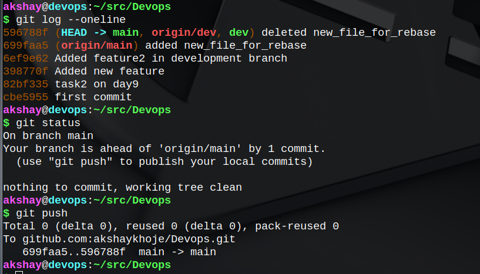
    
    Thus, the merge using `git rebase` is successful!
    

## Happy Learning ;)