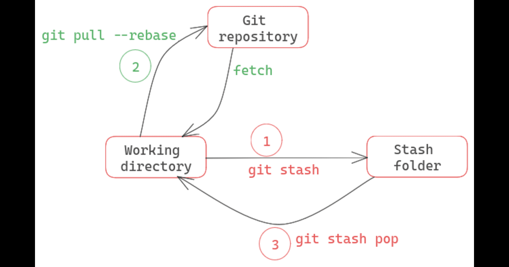
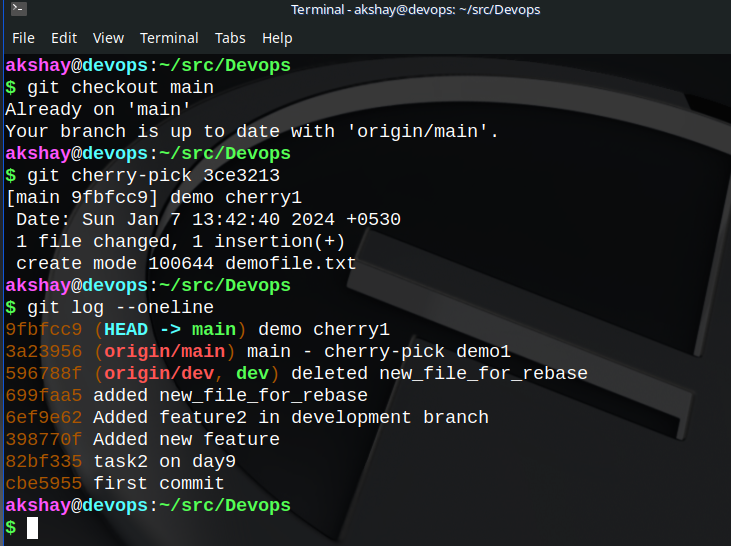
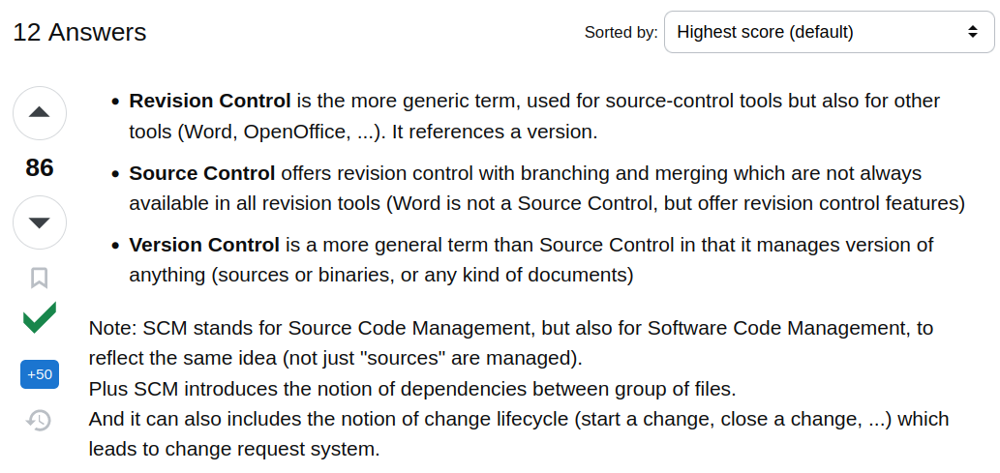
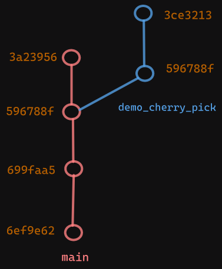
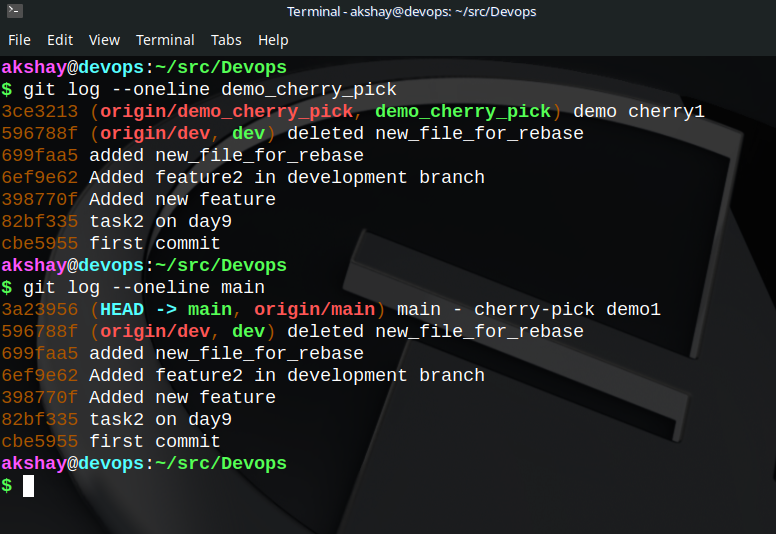

# Day 11 - Advance Git & GitHub for DevOps Engineers: Part-2

## 90DaysOfDevOps

### Scenario - 1

* *You are working on a project - made some significant changes to the project on a specific branch - branch A. Now, your team-mate* ***requires you to switch to another branch -*** *branch X,* *urgently and check on with something. You really don't want to commit where you are on that branch, because you feel it is not "commitable" (not a formal term though), it still requires a specific milestone to be reached to make a proper commit.*
    
* Git doesn't allow you to change a branch directly without committing. Do you lose your work? Will you have to **rewrite the whole code**? And what assures that such an instance won't come again where you have to leave a branch amidst development?
    

### Scenario - 2

* *You are working on branch A and a colleague is working on branch B. You two are working on different features. Your commits so far have not been merged into the* `main` *branch yet. However, you are required by the team to take some* ***older commit*** *from* ***colleague's feature on branch B*** *and* ***build upon it some changes on branch A itself.***
    
* Do you need to write the whole code that was made till that commit? Ughh, little help here...?!
    

---

As a solution to the two scenarios mentioned above, and in fact, given that this is a blog about Git, the answer is **Git** 👻.

### For the Scenario-1, the following command may be useful:

```bash
git stash
```

What this command does is to save the changes made after the last commit, then switch to a different branch, work there whatever, then come back to the working-branch and get the saved changes back in-tact, then continue to work.

The saved changes are brought back with the following command:

```bash
git stash pop
```

* In case you want to delete the changes saved to the stash file, just enter :
    
    ```bash
    git stash drop
    ```
    
* If you want to delete all the stash files for maybe various branches :
    
    ```bash
    git stash clear
    ```
    
    *Some intereseting points of difference* 👇
    

> 

NOTE:  
All the stash files are stored in the `.git` folder of the root directory of the project. Generally found in the `.git/refs` folder.

### For the Scenario-2, the following may help

I made some commits on a new branch - demo\_cherry\_pick to try out this command. The commit status on main branch and demo\_cherry\_pick branch is as follows:



The status before actually doing cherry-pick is as shown below:



Now what I want to do is to have the commit 3ce3213 on main branch after the latest commit on main i.e. I want to pick up a commit from other branch to my own.

* I checked out to the main branch.
    
* I cherry-picked with the commit hash like following:
    
    ```bash
    git cherry-pick 3ce3213
    ```
    
* 
    
    Now you can see that the commit has been brought to the main branch but with a **NEW commit hash**, i.e. the commit has been cherry-picked.
    
* You can also cherry-pick multiple commits in a single command if you want to.
    
* Beware of the **merge conflicts** that may arise though.
    
* In my case, there are no merge conflicts, because I have not touched the same files on both the branches, instead I created new files for demo purpose.
    
* The final step after resolving the merge conflicts(if any), is to push the changes to the remote repository if the need arises.
    

### Happy Learning ;)